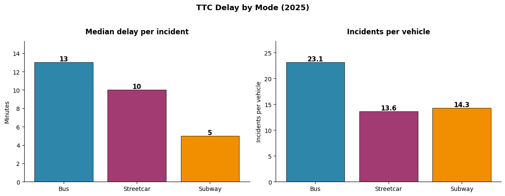
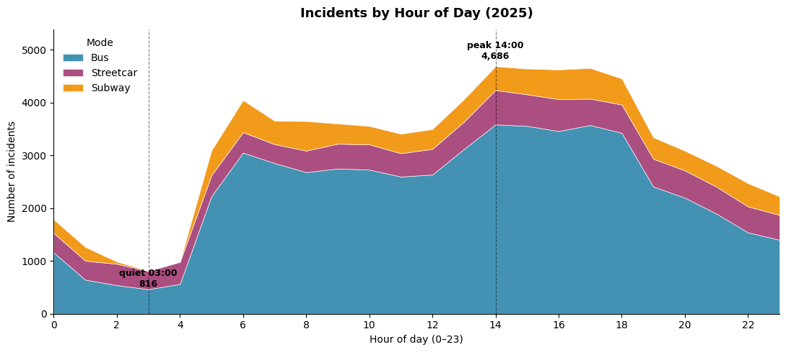
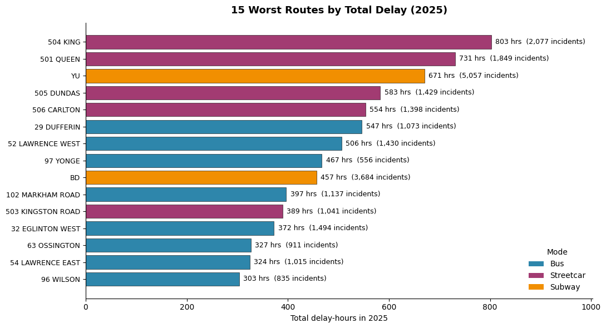
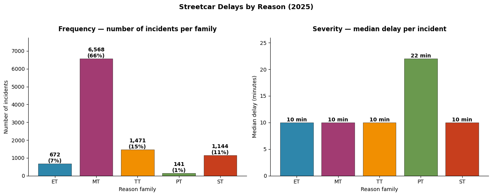

# TTC Delay Analysis
 
**Where, when, and why does Toronto transit fall behind? An incident-level analysis of 2025 TTC delays across buses, streetcars, and subways.**
 
Having lived in Toronto and heard the same complaint over and over — the TTC is unreliable — this project digs into the data to find out where that unreliability actually comes from. Using the City of Toronto's open delay datasets, it combines bus, streetcar, and subway incidents into a single 2025 dataset and works through mode comparison, temporal patterns, worst-offending routes, and root-cause analysis, backed by hypothesis testing rather than eyeballed trends.
 
**▶ [View the interactive dashboard on Hex](https://app.hex.tech/019e3289-2cea-7000-864d-cf528c43eb23/app/TTC-Delay-Analysis-033Htwvuho5wAWNvX8zgal/latest)**
 
---
 
## Key Findings
 
- **Buses drive the largest overall rider impact** — 73% of all delay incidents and 21,452 total delay-hours, far above streetcars (4,214) and subways (1,179), with the highest incidents-per-vehicle rate (23.1).
- **Delays concentrate on weekday commuting hours** — weekdays average ~28% more incidents per day than weekends (confirmed via Mann–Whitney U), peaking at 2 PM and through the afternoon rush.
- **A handful of streetcar routes dominate** — just 4 routes (504 King, 501 Queen, 505 Dundas, 506 Carlton) account for ~60% of all streetcar delay incidents.
- **It's volume, not unique failures** — the worst routes show the same cause mix and median delay (~10 min) as the network; they simply run more service. Most disruption is the steady accumulation of small operational incidents, not rare catastrophic ones.
- **Movement / Operations (MT) causes ~66% of streetcar delays**, while rare Plant/Infrastructure (PT) incidents are the most severe (22 min median).
---
 
## Analysis Sections
 
**1. Data Preparation** — Merge three open-data sources into one incident-level dataset; standardize columns, locations, and timestamps; engineer hour / month / season / weekday features; run data-quality checks.
 
**2. "First Date" with the Data** — High-level mode comparison (incident counts, delay-hours, severity), establishing vehicle count as the fairest cross-mode normalizer.
 
**3. Time Analysis** — Patterns by month, season, day of week, and hour, with a chi-squared goodness-of-fit test (day-of-week) and a Mann–Whitney U test (weekday vs. weekend) to confirm significance. Delay-duration distributions show heavy right-skew, motivating median-based reporting.
 
**4. Worst Routes** — Top 15 routes by total delay-hours, and the individual vehicles logging the most incidents.
 
**5. Root Causes (Streetcars)** — 85 raw delay codes collapsed into five families (Equipment, Movement/Ops, Operator, Infrastructure, Safety); frequency vs. severity, and whether the worst routes behave differently from the rest.
 
**6. Conclusions & Further Exploration** — Synthesis plus a proposed extension on the impact of major events (concerts, games, festivals) on delays.
 
---
 
## Selected Visualizations
 
<!-- IMAGE PLACEHOLDER 1 — from notebook cell 19 (mode comparison: median delay + incidents per vehicle bar charts). Save as images/mode_comparison.png -->

*Median delay and incidents-per-vehicle across bus, streetcar, and subway.*
 
<!-- IMAGE PLACEHOLDER 2 — from notebook cell 26 (stacked area chart of incidents by hour of day, by mode). Save as images/incidents_by_hour.png -->

*Incidents by hour — quiet overnight, sharp morning ramp, sustained afternoon peak at 2 PM.*
 
<!-- IMAGE PLACEHOLDER 3 — from notebook cell 32 (worst 15 routes by total delay hours). Save as images/worst_routes.png -->

*Worst 15 routes by total delay-hours — streetcars dominate the top of the list.*
 
<!-- IMAGE PLACEHOLDER 4 — from notebook cells 39/41 (streetcar delay reasons: frequency and severity by code family). Save as images/streetcar_causes.png -->

*Streetcar delays by cause family — Movement/Operations dominates volume.*
 
---
 
## Repository Structure
 
```
.
├── README.md
├── TTC_Delay_Analysis.ipynb    # Full analysis notebook
└── images/                     # Exported figures for this README
```
 
> **Data:** sourced from the [City of Toronto Open Data Portal](https://open.toronto.ca/) (TTC bus, streetcar, and subway delay datasets). The notebook expects the three raw CSVs in the working directory; they are not redistributed here.
 
---
 
## Running It
 
```bash
pip install pandas numpy matplotlib
jupyter notebook TTC_Delay_Analysis.ipynb
```
 
All statistical tests (chi-squared goodness-of-fit, Mann–Whitney U) are implemented from scratch with `math` / `numpy`, so no `scipy` dependency is required.
 
> **Note on the original source:** this analysis was built in [Hex](https://hex.tech), where it runs as an [interactive dashboard](https://app.hex.tech/019e3289-2cea-7000-864d-cf528c43eb23/app/TTC-Delay-Analysis-033Htwvuho5wAWNvX8zgal/latest). The notebook here is the exported, self-contained version.
 
---
 
## Tech
 
`Python` · `pandas` · `numpy` · `matplotlib` · hypothesis testing (chi-squared, Mann–Whitney U) · distribution analysis · data cleaning & feature engineering · multi-source data integration
 
## How to Export the Figures
 
The charts live in code, not as saved files. To produce the four images above, open the notebook and add `plt.savefig("images/<name>.png", dpi=150, bbox_inches="tight")` just before each `plt.show()` in the relevant cell (cells 19, 26, 32, and 39/41), then run those cells.
 
